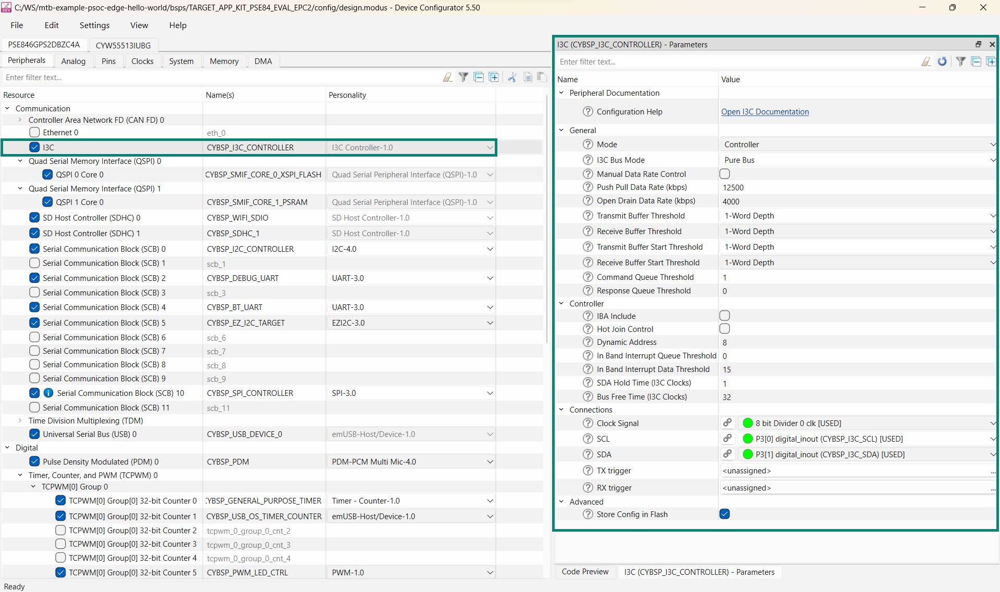
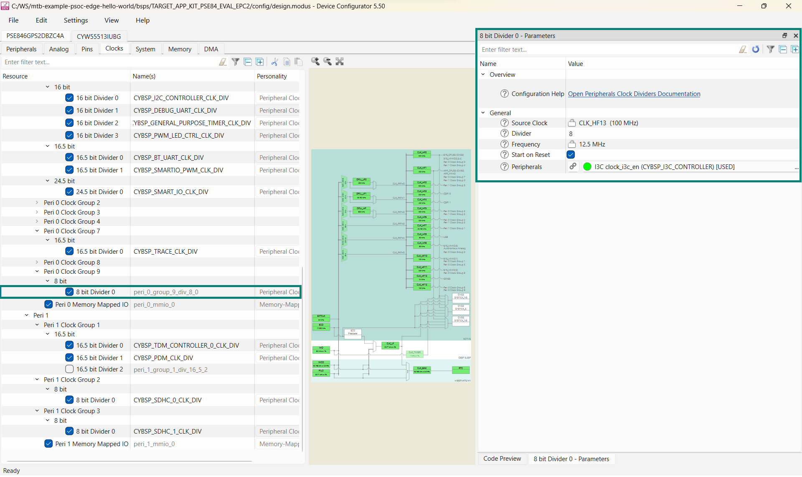

# BMM350 magnetometer sensor

## Overview

This library provides functions for interfacing with the BMM350 I3C 3-axis magnetometer used on the [PSOC&trade; Edge E84 Evaluation Kit](https://www.infineon.com/KIT_PSE84_EVAL) and [PSOC&trade; Edge E84 AI Kit](https://www.infineon.com/KIT_PSE84_AI).

[BMM350 datasheet](https://www.bosch-sensortec.com/media/boschsensortec/downloads/datasheets/bst-bmm350-ds001.pdf)

[BMM350 SensorAPI - Bosch Sensortec](https://github.com/BoschSensortec/BMM350_SensorAPI)

> **Note:** The BMM350 sensor initialization fails when using the I3C interface because of soft reset, causing the sensor interface to default to I2C. However, this issue requires a manual edit to the line of code at [BMM350 SensorAPI](https://github.com/boschsensortec/BMM350_SensorAPI/blob/main/bmm350.c#L219). See the [BMM350_SensorAPI](https://github.com/boschsensortec/BMM350_SensorAPI/issues/3) for details. To help mitigate this, a *bmm350_fix.bash* script is provided that will automatically comment the line, which resolves the issues. This can be implemented for the BMM350 by adding the following to the project (*proj_cm33_ns*) Makefile.

```make
PREBUILD=$(SEARCH_sensor-orientation-bmm350)/COMPONENT_BMM350_I3C/bmm350_fix.bash "$(SEARCH_BMM350_SensorAPI)/bmm350.c"
```


## Quick start

Follow these steps to create a simple application, which outputs the magnetometer data from the sensor to the UART.

1. Create a new application in the ModusToolbox&trade; and select the appropriate board support package (BSP)

2. Select the [PSOC&trade; Edge MCU: Hello world](https://github.com/Infineon/mtb-example-psoc-edge-hello-world) application and create it

3. Add the (sensor-orientation-bmm350) library to the application

4. Use the Device Configurator tool to configure the Serial Communication Block (SCB) as an I3C controller as follows:

   - Enable and configure the Serial Communication Block (SCB) as an I3C controller as highlighted in the following figure

     **Figure 1. SCB I3C controller configuration in Device Configurator**

     

   - Following the previous step, configure an 8-bit peripheral clock divider as highlighted in the following figure

     **Figure 2. Peripheral clock configuration**

     

5. Save the modified configuration(s) in Device Configurator

6. Enable **BMM350_I3C** by adding it to the project's Makefile `COMPONENTS` list or in the *common.mk* file:
   ```
   COMPONENTS+=BMM350_I3C
   ```

7. Place the following code in the *main.c* file of the non-secure application of your project (*proj_cm33_ns*)

    ```
    #include "cybsp.h"
    #include "cy_pdl.h"
    #include "retarget_io_init.h"
    #include "mtb_bmm350.h"

    cy_stc_i3c_context_t CYBSP_I3C_CONTROLLER_context;
    mtb_bmm350_t magnetometer;


    void CYBSP_I3C_CONTROLLER_Interrupt(void)
    {
        Cy_I3C_Interrupt(CYBSP_I3C_CONTROLLER_HW, &CYBSP_I3C_CONTROLLER_context);
    }


    int main(void)
    {
        cy_rslt_t result;
        cy_en_i3c_status_t initStatus;
        cy_en_sysint_status_t sysStatus;
        mtb_bmm350_data_t data;

        cy_stc_sysint_t CYBSP_I3C_CONTROLLER_IRQ_cfg =
        {
            .intrSrc      = CYBSP_I3C_CONTROLLER_IRQ,
            .intrPriority = 2UL
        };

        cy_stc_i3c_device_t i3c_device_address =
        {
            .staticAddress = MTB_BMM350_ADDRESS_SEC
        };

        /* Initializes the device and board peripherals. */
        result = cybsp_init();

        /* Board initialization failed. Stops program execution. */
        if (CY_RSLT_SUCCESS != result)
        {
            CY_ASSERT(0);
        }

        /* Enables global interrupts. */
        __enable_irq();

        /* Initializes retarget-io middleware. */
        init_retarget_io();

        initStatus = Cy_I3C_Init(CYBSP_I3C_CONTROLLER_HW, &CYBSP_I3C_CONTROLLER_config,
                                 &CYBSP_I3C_CONTROLLER_context);
        if (CY_I3C_SUCCESS != initStatus)
        {
            CY_ASSERT(0);
        }
        /* Hooks interrupt service routine. */
        sysStatus = Cy_SysInt_Init(&CYBSP_I3C_CONTROLLER_IRQ_cfg, &CYBSP_I3C_CONTROLLER_Interrupt);
        if (CY_SYSINT_SUCCESS != sysStatus)
        {
            CY_ASSERT(0);
        }
        /* Enables interrupt in NVIC. */
        NVIC_EnableIRQ((IRQn_Type)CYBSP_I3C_CONTROLLER_IRQ_cfg.intrSrc);
        Cy_I3C_Enable(CYBSP_I3C_CONTROLLER_HW, &CYBSP_I3C_CONTROLLER_context);

        /* Initializes the sensor. */
        result = mtb_bmm350_init_i3c(&magnetometer, CYBSP_I3C_CONTROLLER_HW,
                                     &CYBSP_I3C_CONTROLLER_context, &i3c_device_address);
        if (CY_RSLT_SUCCESS != result)
        {
            CY_ASSERT(0);
        }

        for (;;)
        {
            /* Gets the magnetometer data and temperature, and print the results to the UART. */
            result = mtb_bmm350_read(&magnetometer, &data);
            printf("\nMag: %f, %f, %f \r\n", (double)data.sensor_data.x, (double)data.sensor_data.y,
                   (double)data.sensor_data.z);
            printf("Temp: %f\r\n\n", (double)data.sensor_data.temperature);
            Cy_SysLib_Delay(1000);
        }
    }
    ```

8. Builds the application and program the kit


## More information

For more information, see the following documents:

* [API reference guide](./api_reference.md)
* [ModusToolbox&trade; software environment, quick start guide, documentation, and videos](https://www.infineon.com/modustoolbox)
* [AN235935](https://www.infineon.com/AN235935) – Getting started with PSOC&trade; Edge MCU on ModusToolbox&trade; application note
* [Infineon Technologies AG](https://www.infineon.com)

-----
© 2025, Cypress Semiconductor Corporation (an Infineon company) or an affiliate of Cypress Semiconductor Corporation.
